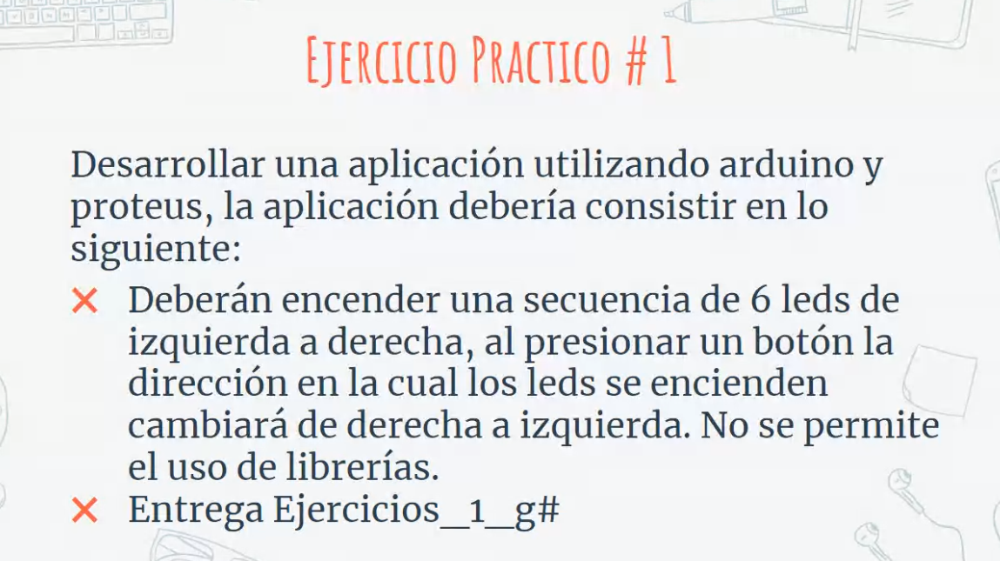
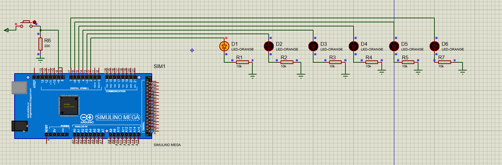

### Universidad de San Carlos
### Arquitectura de computadores y ensambladores 1
## Carlos Agustín Ché Mijangos  
---


# Ejercicio Serie de leds

# Diseño Final

# Codigo
```C
boolean direccion = true;
void setup() {
  // put your setup code here, to run once:
  pinMode(2, OUTPUT);
  pinMode(3, OUTPUT);
  pinMode(4, OUTPUT);
  pinMode(5, OUTPUT);
  pinMode(6, OUTPUT);
  pinMode(7, OUTPUT);
  pinMode(8, INPUT);
  
}

void loop() {
  // put your main code here, to run repeatedly:
  if(digitalRead(8) == HIGH){
    direccion = !direccion;
    delay(10);
  }

  if(direccion){
    derecha();
  }else{
    izquierda();
  }
}

void derecha(){
  digitalWrite(2, HIGH);
  delay(500);
  digitalWrite(2, LOW);
  digitalWrite(3, HIGH);
  delay(500);
  digitalWrite(3, LOW);
  digitalWrite(4, HIGH);
  delay(500);
  digitalWrite(4, LOW);
  digitalWrite(5, HIGH);
  delay(500);
  digitalWrite(5, LOW);
  digitalWrite(6, HIGH);
  delay(500);
  digitalWrite(6, LOW);
  digitalWrite(7, HIGH);
  delay(500);
  digitalWrite(7, LOW);
}

void izquierda(){
  digitalWrite(7, HIGH);
  delay(500);
  digitalWrite(7, LOW);
  digitalWrite(6, HIGH);
  delay(500);
  digitalWrite(6, LOW);
  digitalWrite(5, HIGH);
  delay(500);
  digitalWrite(5, LOW);
  digitalWrite(4, HIGH);
  delay(500);
  digitalWrite(4, LOW);
  digitalWrite(3, HIGH);
  delay(500);
  digitalWrite(3, LOW);
  digitalWrite(2, HIGH);
  delay(500);
  digitalWrite(2, LOW);
}
```